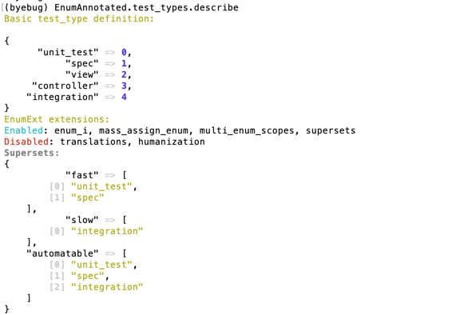
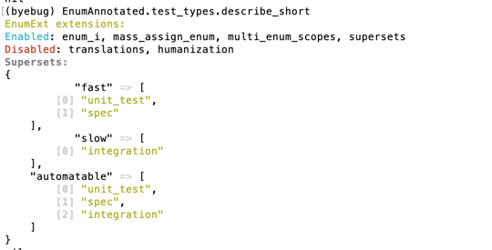
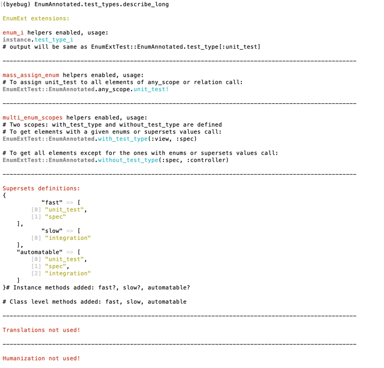
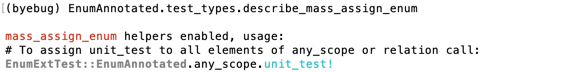

# EnumExt

EnumExt extends rails enum with localization/translation and it's helpers, mass-assign on scopes with bang, advanced sets logic over existing enum.

## Installation

Add this line to your application's Gemfile:

```ruby
gem 'enum_ext', '~> 0.8'
```

And then execute:

    $ bundle

Or install it yourself as:

    $ gem install enum_ext

## Usage
 To use enum extension extend main model class with EnumExt module, 
 and customize your enums the way you need:
 
```ruby
      
   class SomeModel
      extend EnumExt
        
      enum status: {}, ext: [:enum_i, :enum_mass_assign, enum_supersets: { superset: [:basic_enum] } ]
      humanize_enum  #...
      translate_enum #...
      ext_enum_sets  # if needed 
  end
```
 
 Let's assume that we have model Request representing some buying requests with enum **status**, and we have model Order with requests, 
 representing single purchase, like this:

```ruby
     class Request
       extend EnumExt
       belongs_to :order
       enum status: [ :in_cart, :waiting_for_payment, :paid, :ready_for_shipment, :on_delivery, :delivered ]
     end

     class Order
       has_many :requests
     end
```

## Inline definitions. Starting 0.5.0!! BREAKING CHANGES!

Starting version 0.4.6, for concise and clearer code base, you can activate most of the extensions during enum definition, using `ext: [...]` notation.
This is a preferable way now, and old helpers are private starting version 0.6!:

```ruby
    #Instead of three method calls:    
    enum status: {}
    enum_i :status # will raise an private method error starting ver 0.6
    enum_mass_assign :status # will raise an private method error starting ver 0.6!!!

    #You should go with ext  option instead:
    enum status: {}, ext: [:enum_i, :enum_mass_assign]

    # OR in case of standalone enum definition:
    enum status: {} # somewhere where you can't or don't want to reach 
    enum_ext :status, [:enum_i, :enum_mass_assign, enum_supersets: {} ]
```
Rem: enum_ext could be called multiple times and merge later definitions, though I can't imagine why would you split it to multiple calls. 

Rem: The only exceptions for the new syntax are full translation/humanization helpers definitions. 
     Those will not add any clarity to code, and should be used via standalone helpers. 
     But standard translate_enum without definitions still welcome:

```ruby
# GOOD: 
  enum_ext :status, [:enum_i, :enum_mass_assign, :translate_enum, enum_supersets: {}]

# BAD (even if correctly defines internationalization): 
  enum_ext :status, [:enum_i, :enum_mass_assign, :translate_enum, enum_supersets: {}] do
    I18n.t("scope.#{kind}")
  end
```

## Humanization and localization

### Humanization (humanize_enum) 
  
  If app doesn't need internationalization, it may use humanize_enum to make enum output user friendly

```ruby
  humanize_enum :status, {
      #locale dependent example with pluralization and lambda:
      in_cart: -> (t_self) { I18n.t("request.status.in_cart", count: t_self.sum ) },
  
      #locale dependent example with pluralization and proc:
      paid: Proc.new{ I18n.t("request.status.paid", count: self.sum ) },
  
      #locale independent:
      ready_for_shipment: "Ready to go!"
    }
```  
   
  This humanize_enum adds to instance:
   - t_status
  
  and to enum object:
   - statuses.t_options - translated enum values options for select input
   - statuses.t_options_i - same as above but use int values with translations works for ActiveAdmin filters for instance
   

  Example with block:

  ```ruby
      humanize_enum :status do
        I18n.t("scope.#{status}")
      end
  ```
  
  Example for select:
  
  ```ruby
    f.select :status, Request.statuses.t_options
  ```
  
  in Active Admin filters
  ```ruby
    filter :status, as: :select, label: 'Status', collection: Request.statuses.t_options_i
  ```
  
  **Rem:** select options may break when using lambda() or proc with instance method, but will survive with block
  
  Console:
  ```ruby
    request.sum = 3
    request.paid!
    request.status     # >> paid
    request.t_status   # >> "paid 3 dollars"
    Request.statuses.localizations # >> { in_cart: -> { I18n.t("request.status.in_cart") }, ....  }
  ```  

  Could be called multiple times, all humanization definitions will be merged under the hood.  
    
### Translate (translate_enum) 

Enum is translated using scope 'active_record.attributes.class_name_underscore.enum_plural', or the given one:

```ruby
   translate_enum :status, 'active_record.request.enum'
```
Or it can be done with block either with translate or humanize:

```ruby
   translate_enum :status do 
     I18n.t( "active_record.request.enum.#{status}" )
   end
```

All humanization examples also should work same way as expected.

## Enum extended functionality

### Enum to_i shortcut ( enum_i )

Defines method enum_name_i shortcut for Model.enum_names[elem.enum_name] or enum_name_before_type_cast

**Ex** 
```ruby
  enum status: [:in_cart, :waiting_for_payment, :paid, :ready_for_shipment, :on_delivery, :delivered],
       ext: [:enum_i]
# some place else:
  request.paid_i # 10
```

Rem: whenever underlying enum is not an integer will refuse to define helper and outputs WARNING

### Enum SuperSets (enum_supersets)
 
 **Use-case** whenever you need superset of enums to behave like a super enum.
 
 You can do this with method **enum_supersets** it creates: 
   - scopes for subsets, 
   - instance methods with `?` 
   
   For instance:

```ruby
     enum status: [:in_cart, :waiting_for_payment, :paid, :packing, :ready_for_shipment, :on_delivery, :delivered],
          ext: [enum_supersets: {
                  around_delivery: [:ready_for_shipment, :on_delivery], # for shipping department for example
                  in_warehouse: [:packing, :ready_for_shipment],    # this scope is just for superposition example below
                  sold: [:paid, :around_delivery, :in_warehouse, :delivered] # also you can define any superposition of already defined supersets or enum values
                }]

     # supersets will be stored inside enum wrapper object, and can be de-referenced to basic enum values 
     # using wrapper defined methods: "superset_enum_plural", i.e. statuses.sold_statuses -> [:paid, :packing, :ready_for_shipment, :on_delivery, :delivered]
     # so new supersets could be defined using Array operations against newly defined methods
     enum_ext :status, enum_supersets: {
                    outside_warehouse: ( statuses.around_delivery - statuses.in_warehouse ) #... any other array operations like &, + and so can be used
                  }
```

it will generate:

```
instance:
    - methods: around_delivery?, in_warehouse?

class:
    - named scopes: around_delivery, in_warehouse

enum methods:    
    - Class.statuses.supersets -- will output superset definition hash
    - Class.statuses.supersets_raw -- will output superset decompositions to basic enum types hash 
    
    - Class.statuses.around_delivery (=[:ready_for_shipment, :on_delivery, :delivered] ), in_warehouse_statuses
    - around_delivery_statuses_i (= [3,4,5]), in_warehouse_statuses_i (=[3])

    translation helpers grouped for superset ( started with t_... ):
    - Class.statuses.t_around_delivery_options (= [['translation or humanization', :ready_for_shipment] ...] ) for select inputs purposes
    - Class.statuses.t_around_delivery_options_i (= [['translation or humanization', 3] ...]) same as above but with integer as value ( for example to use in Active admin filters )
```

 ```ruby
    request.on_delivery!
    request.around_delivery?                    # >> true
    
    Request.around_delivery.exists?(request)    # >> true
    Request.in_warehouse.exists?(request)    # >> false
    
    Request.statuses.around_delivery            # >> ["ready_for_shipment", "on_delivery", "delivered"]
```
Rem:
supersets creation could be called multiple times defining a superposition of already defined sets ( considering previous example ):

```ruby
 enum_ext :status, enum_supersets: {
   outside_wharehouse: ( statuses.around_delivery_superset - statuses.in_warehouse_superset )#... any other array operations like &, + and so can be used
 }
```

Rem: you can refer previously defined set as usual kind in the same method call:
    
```ruby
    enum_ext :status, enum_supersets: {
        around_delivery: [:ready_for_shipment, :on_delivery, :delivered],
        not_in_cart: [:paid, :around_delivery] #
    }
```

### Multi enum scopes

```ruby
  enum status: [:in_cart, :waiting_for_payment, :paid, :ready_for_shipment, :on_delivery, :delivered],
       ext: [:multi_enum_scopes]

# some place else:
    Request.with_statuses( :payed, :around_delivery )    # >> status IN (:payed, :ready_for_shipment, :on_delivery, :delivered) 
    Request.without_statuses( :payed, :in_warehouse ) # >> status NOT IN (:payed, :ready_for_shipment)
``` 

### Mass-assign ( enum_mass_assign )
 
 Syntax sugar for mass-assigning enum values. 
 
 **Use-case:** it's often case when I need bulk update without callbacks, so it's gets frustrating to repeat: 
 ```
    some_scope.update_all(status: :new_status, update_at: Time.now)
 ```
 If you need callbacks you can do like this: some_scope.each(&:new_stat!) but if you don't need callbacks and you 
 have hundreds and thousands of records to change at once you better call update_all

 ```ruby
   enum status: [:in_cart, :waiting_for_payment, :paid, :ready_for_shipment, :on_delivery, :delivered],
        ext: [:mass_assign_enum]
 ```

 Console:

```ruby
    request1.in_cart!
    request2.waiting_for_payment!
    Request.not_paid.paid!
   
    request1.reload.paid?                          # >> true
    request2.paid?                          # >> true
    request1.updated_at                     # >> ~ Time.now
    
    order.requests.already_paid.count           # >> N
    order.requests.delivered.count              # >> M
    order.requests.already_paid.delivered!
    order.requests.already_paid.count          # >> 0
    order.requests.delivered.count              # >> N + M
```

## Annotations helpers
Sometimes under irb console you need a quick tip on whats extension available on a enum, so some describe_* helpers added to enum wrapper

General description methods (describe/describe_short/describe_long)
```
  Class.enum.describe
```  


```
  Class.enum.describe_short
```


```
  Class.enum.describe_long
```


And per extension methods (describe_enum_i, e.t.c)

```ruby
 EnumAnnotated.test_types.describe_mass_assign_enum
```


## Tests
Starting version 0.6 added support for rails 7+ enum definitions, that's making testing a little bit not that easy as running `rake test`.
Now testings are done via `docker-compose up`. Look closer to Dockerfiles and `docker-compose.yml` 
to get the idea how they working simultaneously without interference with each other. 

Rem. I'm always freaking googling everytime I need to run single test so I'll just keep here:

```ruby
rake test TEST=test/test_enum_ext.rb TESTOPTS="--name=/bb/"
```

## Development

## TODO
[] add global config and allow global extension

## Contributing
Bug reports and pull requests are welcome on GitHub at https://github.com/alekseyl/enum_ext or by email: leshchuk@gmail.com


## License

The gem is available as open source under the terms of the [MIT License](http://opensource.org/licenses/MIT).


### Thanks
Thanks for the first star to vzamanillo, it inspires me to do mass refactor and gracefully cover code in this gem by tests.
